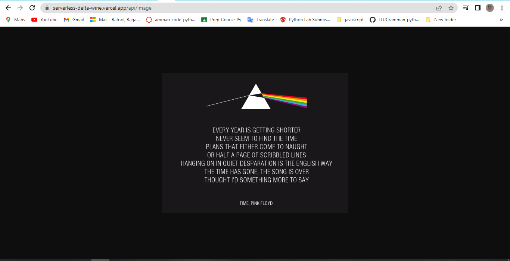
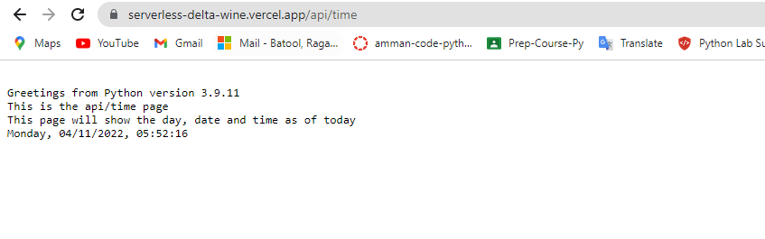

# **Lab16: Serverless Functions**

 

## **Description of the feature tasks that my serverless function completed**

- The function handled a GET http request.
- The function accomplished some useful task (show an image and show the day/date/time/year)
- The function parsed the url path’s query string.

 

## **Visualization**

1. After deploying my server on *vercel.com*
2. And add to the already existing url those two paths: 
    - "**api/image**":
    
        this path showed me an image of a personally favourite lyric from my favourite song, as below:

        

    - "**api/time**":

        this path showed me a text message along with the day/date/time/year of today , as below:

        